  &nbsp;
  &nbsp;
  &nbsp;
  &nbsp;
  &nbsp;
  &nbsp;
  &nbsp;
  &nbsp;
  &nbsp;
  

  <h1>¡Hola, soy AguilaRFreddy!</h1>
  
  

    
  

  <!-- El juego de la serpiente -->
  

---

<h2 align="center">Sobre Mí</h2>

<table width="100%" border="0">
<tr>
<td width="50%" valign="top" align="left" style="padding-left: 20px; border: none;">

### Formación
*  **Instituto Tecnológico de Morelia**
*  **Ingeniería en Sistemas Computacionales**
*  Enfocado en el aprendizaje continuo y en el desarrollo de soluciones eficientes.

</td>
<td width="50%" valign="top" align="left" style="padding-left: 20px; border: none;">

### Intereses
*  **Networking & Ciberseguridad**
*  **Bases de Datos**
*  **Desarrollo de Soluciones de Software**

</td>
</tr>
</table>

---

  <!-- Imagen decorativa de las fases de la luna -->
  

---

<h2 align="center">Tecnologías y Herramientas</h2>

  
  
  
  
  
  
  
  
  
  
  
  
  
  
  

---

<h2 align="center">Conecta Conmigo</h2>

    

  

  <!-- Contador de visitas discreto abajo -->
  

  &nbsp;
  &nbsp;
  &nbsp;
  &nbsp;
  &nbsp;
  &nbsp;
  &nbsp;
  &nbsp;
  &nbsp;
  

